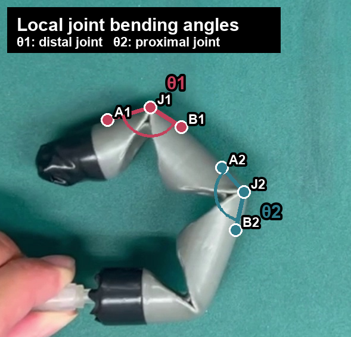

# Lightweight Tactile Object Recognition for Soft Robotic Hands via LTC-RNN

This repository contains the dataset, training scripts, figure-generation utilities, and Arduino deployment code for lightweight tactile object recognition with a five-finger soft robotic hand. The project uses flex-sensor time-series signals collected during grasping and classifies object categories with Liquid Time-Constant Recurrent Neural Networks (LTC-RNNs).

In addition to desktop-side model training and evaluation, this repository includes Arduino Uno inference sketches. The Arduino workflow can trigger a grasp through relay outputs, collect a 400-step flex-sensor window, run z-score normalization, perform LTC-4 Euler updates, and print the predicted object class.

## Research Pipeline

```text
Five-finger soft robotic hand
  -> Flex-sensor bending measurement
  -> 400-step ADC time series
  -> z-score normalization
  -> LTC-RNN / Vanilla RNN / LSTM
  -> Object classification and on-board inference tests
```

Two sensing configurations are compared:

```text
5-channel: Thumb, Index, Middle, Ring, Pinky
3-channel: Thumb, Middle, Pinky
```

The 5-channel setting keeps the full finger-sensing information, while the 3-channel setting evaluates whether reduced sensor input can still preserve usable recognition performance.

## Hardware and Sensing Overview

<p align="center">
  
  
</p>

When a soft finger grasps an object, its deformation changes the flex-sensor ADC values. Different object shapes, sizes, stiffness levels, and contact locations produce distinct bending sequences across the fingers, forming tactile features for object recognition.

Each sample contains 400 time steps with a 10 ms sampling period, for an approximately 4 s grasping window. CSV files include `Time_ms` and finger-wise ADC columns.

## Dataset

The main dataset is located at:

```text
data/dataset_new_new_new/
```

It is a cleaned and renamed 10-class raw ADC dataset. Each class contains 100 valid samples, giving 1000 CSV files in total.

Object classes:

```text
Baseball
Bottle
Sponge Dice
Tape
Plush Toy
Optical Mouse
Smartphone
Rubik's Cube
Stuffed Ball
3D-Printed Part
```

Example 5-channel CSV format:

```text
Time_ms,Thumb,Index,Middle,Ring,Pinky
0,737,727,753,715,792
10,737,726,754,715,793
20,738,727,754,716,793
```

The 3-channel dataset is generated from the 5-channel dataset by keeping `Thumb`, `Middle`, and `Pinky`, then renumbering files within each class:

```text
data/dataset_new_new_new_3ch/
data/dataset_new_new_new_3ch_manifest.csv
```

The manifest records the source 5-channel CSV corresponding to each 3-channel CSV.

## Model Settings

The main model family is LTC-RNN. LTC-RNN describes hidden-state dynamics in continuous time and is implemented with Euler discretization, making it suitable for continuous flex-sensor time-series signals.

Model configurations included in the experiments:

```text
LTC-RNN: LTC-1, LTC-2, LTC-4, LTC-8, LTC-16
Vanilla RNN: 4, 8, 16 hidden units
LSTM: 4, 8, 16 hidden units
```

The Arduino deployment focuses on LTC-4 because it provides a practical balance between recognition performance, parameter count, and on-board inference cost.

## Paper Figures

### LTC Neuron Sweep

<p align="center">
  
</p>

This figure compares LTC-1, LTC-2, LTC-4, LTC-8, and LTC-16 under 5-channel and 3-channel inputs. The goal is not only to maximize neuron count, but also to observe whether additional model complexity still provides meaningful performance gains.

### Model Benchmark

<p align="center">
  
</p>

This figure compares Vanilla RNN, LSTM, and LTC models using Accuracy and Macro-F1 under 3-channel and 5-channel settings. Macro-F1 is included to reflect class-wise performance rather than relying only on overall accuracy.

### Few-Shot Training Sample Analysis

<p align="center">
  
</p>

This figure evaluates LTC-4 performance as the number of training samples per object changes from 10 to 60. It is used to discuss data efficiency under limited-data conditions.

### Confusion Matrix

<p align="center">
  
</p>

The confusion matrices are row-normalized. Dark diagonal cells indicate higher correct classification ratios, while off-diagonal cells show which object categories are more easily confused.

Full-label versions are also kept at:

```text
figures/paper_figures/paper_confusion_no_numbers_5ch_3ch.png
figures/paper_figures/bptt_mean_confusion_5ch.png
figures/paper_figures/bptt_mean_confusion_3ch.png
```

### Parameter Count Comparison

<p align="center">
  
</p>

This figure compares the parameter count of LTC-4 with Vanilla RNN-8 and LSTM-8, showing why LTC-4 is a practical candidate for microcontroller deployment.

## Finger Bending θ Analysis

The manually annotated local joint-angle analysis is stored at:

```text
analysis/finger_bending_theta_analysis/
```

It includes the original finger-bending video, 0.5 s extracted frames, manually clicked point data, corrected θ1 / θ2 angle tables, an Excel workbook, and PPT-ready figures.

<p align="center">
  
</p>

Frame preview used for manual point annotation:

<p align="center">
  
</p>

The local joint angles are defined as:

```text
θ1 = 180 deg - angle(A1, J1, B1)
θ2 = 180 deg - angle(A2, J2, B2)
```

## Main Entry Points

Training and analysis scripts:

```text
src/ltc_bptt_5ch/run_extended_rnn_lstm_ltc_benchmark.py
src/ltc_bptt_5ch/run_ltc4_few_shot_10_60_channels.py
src/ltc_bptt_5ch/run_deployment_candidates.py
src/ltc_bptt_3ch/run_ltc_neuron_sweep_3ch.py
```

Dataset preprocessing utilities:

```text
src/utils/z_score.py
src/utils/create_3ch_dataset.py
src/utils/split_data.py
```

Figure-generation scripts:

```text
figures/paper_figures/make_paper_compact_figures.py
figures/paper_figures/make_extended_benchmark_accuracy_by_family.py
figures/paper_figures/make_few_shot_models_5ch_3ch.py
figures/paper_figures/make_ltc_neuron_sweep_5ch_3ch_bar.py
figures/paper_figures/make_model_parameter_bar.py
```

## Python Environment

Create a Python virtual environment and install dependencies:

```bash
pip install -r requirements.txt
```

Main packages:

```text
TensorFlow / Keras
NumPy
pandas
scikit-learn
matplotlib
seaborn
SciPy
Numba
```

## Arduino Uno Deployment

Arduino sketches are located at:

```text
arduino/deployment_candidates/
```

LTC-4 relay-control variants:

```text
arduino/deployment_candidates/ltc4_best_low_active/ltc4_best_low_active.ino
arduino/deployment_candidates/ltc4_best_high_active/ltc4_best_high_active.ino
```

Use the low-active version when the relay input is active at `LOW`; use the high-active version when the relay input is active at `HIGH`.

Arduino pin assignment:

```text
Flex sensor analog input: A0, A1, A2, A3, A4
Relay control output:     D2, D3, D4, D5, D6
Serial baud rate:         115200
```

Serial Monitor commands:

```text
g  Start one 400-sample grasp window
r  Release all relays
b  Run inference benchmark on a flash-stored 400-sample window
t  Print one task-level timing breakdown
m  Repeat the flash benchmark 100 times
d  Repeat the timing breakdown 100 times
```

`g` command flow:

```text
Enter g
  -> sample flex sensors every 10 ms
  -> keep the first 1.5 s as the pre-grasp baseline period
  -> activate five relays after 1.5 s to start grasping
  -> collect 400 samples
  -> run z-score normalization
  -> run LTC-4 Euler updates
  -> run dense layer and softmax
  -> print the predicted class and confidence
  -> turn off relays and release
```

Hardware safety note:

```text
Arduino analog pins -> flex-sensor voltage-divider outputs
Arduino digital pins -> relay module input pins
Arduino GND -> relay control-side GND
```

The Arduino only handles low-voltage control signals. The relay module needs an appropriate DC supply. The pump, solenoid valve, and 110 V load side must not be connected directly to Arduino logic pins; the high-voltage side should remain isolated and controlled only through relay contacts.

See also:

```text
arduino/README.md
```

## Experiment Tools

Experiment data-collection and relay-test utilities are located at:

```text
experiment_tools/
```

The folder includes 5-channel flex-sensor data collection, single-channel flex ADC reading, flex-resistance measurement, relay testing, and parser tests. Usage details are provided in:

```text
experiment_tools/README.md
UPLOAD_INSTRUCTIONS.md
```

## Repository Structure

```text
experiment_tools/                 Data collection, Arduino tests, and sensor tools

data/
  dataset_new_new_new/            10-class 5-channel raw ADC dataset
  dataset_new_new_new_3ch/        10-class 3-channel raw ADC dataset

src/
  ltc_bptt_5ch/                   5-channel LTC-RNN training, benchmarks, few-shot tests, and deployment export
  ltc_bptt_3ch/                   3-channel LTC-RNN experiments
  baselines/                      Vanilla RNN, LSTM, and legacy 1D-CNN baselines
  utils/                          Dataset conversion, z-score, and split utilities

arduino/
  deployment_candidates/          Arduino Uno deployment sketches
  ltc4_zscore_inference/          Legacy LTC-4 z-score inference sketch

figures/
  paper_figures/                  Paper figures, source tables, and figure scripts

docs/
  EXCLUDED_FILES.md               Files intentionally excluded from this public repository
```

## Excluded Files

This repository intentionally excludes private thesis/front-matter PDFs, teacher draft files, old temporary datasets, Python caches, virtual environments, large generated intermediate outputs, and local-only training checkpoints. The goal is to keep only the files needed to understand the data format, reproduce the main experiments, regenerate figures, and test Arduino deployment.
