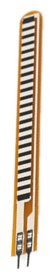
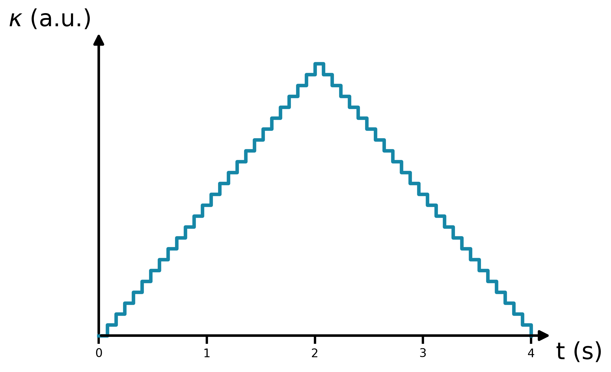
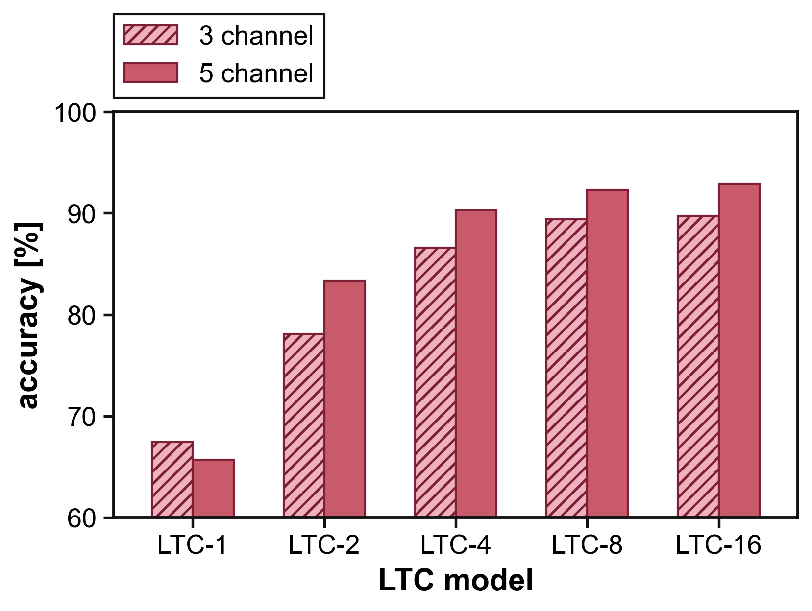
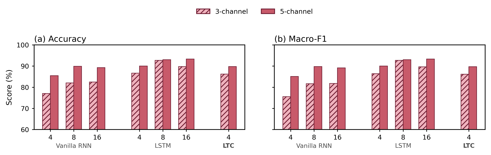
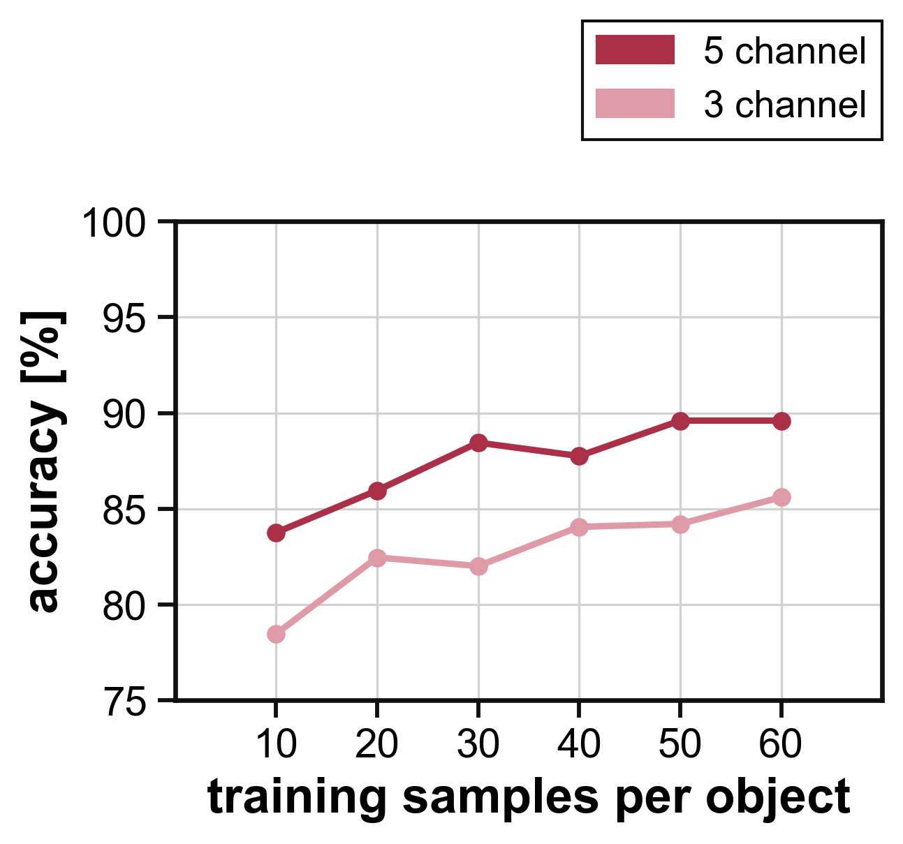
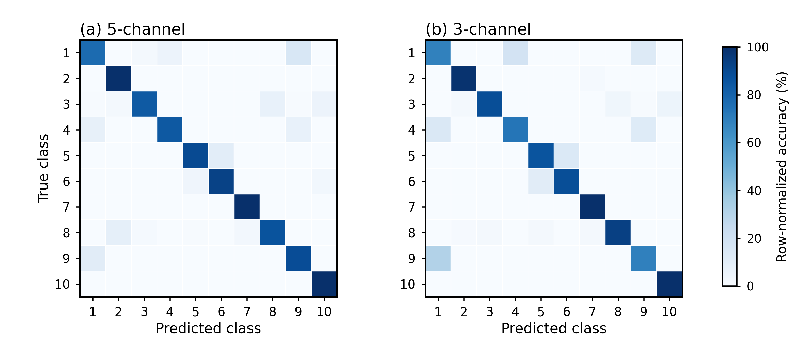
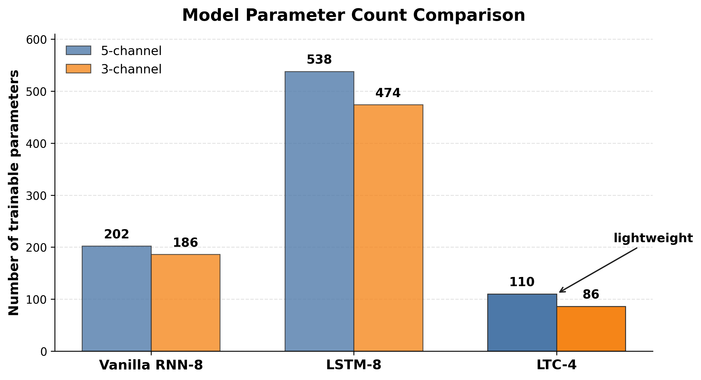

# 基於液態時間常數網路之輕量化觸覺辨識架構於軟式機器人應用

本專案整理了以五指仿人軟式機械手進行觸覺物件辨識的資料集、訓練程式、圖表腳本，以及 Arduino Uno 端的部署程式。研究核心是使用手指上的 flex sensor 取得抓握時的彎曲時間序列，並以 Liquid Time-Constant RNN, LTC-RNN 進行輕量化分類。

相較於只把模型放在電腦端推論，本專案也保留了 Arduino 端測試流程：可以從序列監控視窗送出指令、控制繼電器啟動抓握、收集 400-step 感測資料，並在板子上執行 LTC-4 inference。

## 研究流程

```text
五指軟式機械手
  -> flex sensor 量測手指彎曲
  -> 400-step ADC 時間序列
  -> z-score normalization
  -> LTC-RNN / Vanilla RNN / LSTM
  -> 物件分類與 on-board inference 測試
```

本專案目前主要比較兩種輸入設定：

```text
5-channel: Thumb, Index, Middle, Ring, Pinky
3-channel: Thumb, Middle, Pinky
```

5-channel 用於保留五指完整感測資訊；3-channel 用於評估在較少感測器輸入下，模型是否仍能維持可用辨識能力。

## 硬體與感測示意

<p align="center">
  
  
</p>

軟式手指在抓握物體時會產生彎曲變形，flex sensor 將變形轉換成 ADC 數值。不同物件的形狀、尺寸、硬度與接觸位置不同，因此五根手指的彎曲序列會形成不同的觸覺特徵。

<p align="center">
  
</p>

每筆資料為 400 個取樣點，取樣週期為 10 ms，總長約 4 s。CSV 檔含有 `Time_ms` 與各手指 ADC 欄位。

## 資料集

主要資料集位於：

```text
data/dataset_new_new_new/
```

這是重新整理與命名後的 10 類 raw ADC dataset。每一類保留 100 筆有效資料，總共 1000 個 CSV 檔。

物件類別如下：

```text
Baseball
Bottle
Sponge Dice
Tape
Plush Toy
Optical Mouse
Smartphone
Rubik's Cube
Stuffed Ball
3D-Printed Part
```

5-channel CSV 欄位範例：

```text
Time_ms,Thumb,Index,Middle,Ring,Pinky
0,737,727,753,715,792
10,737,726,754,715,793
20,738,727,754,716,793
```

3-channel dataset 由 5-channel dataset 擷取 `Thumb`, `Middle`, `Pinky` 後重新編號而成：

```text
data/dataset_new_new_new_3ch/
data/dataset_new_new_new_3ch_manifest.csv
```

`dataset_new_new_new_3ch_manifest.csv` 紀錄每一筆 3-channel CSV 對應到原始 5-channel CSV 的來源。

## 模型設定

本專案主模型為 LTC-RNN。LTC-RNN 使用連續時間動態描述 hidden state，實作時透過 Euler method 離散化，因此適合處理 flex sensor 這類連續變化的時間序列訊號。

主要模型與比較項目：

```text
LTC-RNN: LTC-1, LTC-2, LTC-4, LTC-8, LTC-16
Vanilla RNN: 4, 8, 16 hidden units
LSTM: 4, 8, 16 hidden units
```

目前 Arduino deployment 以 LTC-4 為主要候選，原因是參數量較少，且能在辨識表現與 on-board inference 成本之間取得較好的平衡。

## 實驗圖表

### LTC 神經元數量比較

<p align="center">
  
</p>

此圖用於比較 LTC-1, LTC-2, LTC-4, LTC-8, LTC-16 在 5-channel 與 3-channel 輸入下的辨識結果。重點不是只追求最大神經元數，而是觀察模型複雜度增加後，表現是否仍有明顯提升。

### 模型 benchmark

<p align="center">
  
</p>

此圖將 Vanilla RNN、LSTM 與 LTC 放在同一張圖中，以 Accuracy 與 Macro-F1 比較 3-channel 與 5-channel 表現。Macro-F1 用於觀察各類別平均表現，避免只看 overall accuracy 而忽略類別不均或特定類別混淆。

### Few-shot 訓練樣本數分析

<p align="center">
  
</p>

此圖觀察每類訓練樣本數從 10, 20, 30, 40, 50 到 60 筆時，5-channel 與 3-channel 的 LTC-4 表現變化。用途是說明模型在 limited data 條件下的資料效率。

### Confusion matrix

<p align="center">
  
</p>

Confusion matrix 使用 row-normalized percentage 呈現。深色對角線代表該類別被正確分類的比例較高；非對角線顏色則可用來觀察哪些物件容易互相混淆。

完整類別標籤版本也保留於：

```text
figures/paper_figures/paper_confusion_no_numbers_5ch_3ch.png
figures/paper_figures/bptt_mean_confusion_5ch.png
figures/paper_figures/bptt_mean_confusion_3ch.png
```

### 參數量比較

<p align="center">
  
</p>

此圖用於說明 LTC-4 相較於 Vanilla RNN-8 與 LSTM-8 的模型參數量較少，適合作為 microcontroller 端部署候選。

## 主要程式入口

Python 訓練與分析腳本：

```text
src/ltc_bptt_5ch/run_extended_rnn_lstm_ltc_benchmark.py
src/ltc_bptt_5ch/run_ltc4_few_shot_10_60_channels.py
src/ltc_bptt_5ch/run_deployment_candidates.py
src/ltc_bptt_3ch/run_ltc_neuron_sweep_3ch.py
```

資料前處理與 dataset 工具：

```text
src/utils/z_score.py
src/utils/create_3ch_dataset.py
src/utils/split_data.py
```

圖表產生腳本：

```text
figures/paper_figures/make_paper_compact_figures.py
figures/paper_figures/make_extended_benchmark_accuracy_by_family.py
figures/paper_figures/make_few_shot_models_5ch_3ch.py
figures/paper_figures/make_ltc_neuron_sweep_5ch_3ch_bar.py
figures/paper_figures/make_model_parameter_bar.py
```

## Python 環境

建議先建立 Python virtual environment，再安裝依賴套件：

```bash
pip install -r requirements.txt
```

主要套件包含：

```text
TensorFlow / Keras
NumPy
pandas
scikit-learn
matplotlib
seaborn
SciPy
Numba
```

## Arduino Uno 部署

Arduino 程式位於：

```text
arduino/deployment_candidates/
```

LTC-4 有兩個繼電器觸發版本：

```text
arduino/deployment_candidates/ltc4_best_low_active/ltc4_best_low_active.ino
arduino/deployment_candidates/ltc4_best_high_active/ltc4_best_high_active.ino
```

如果繼電器輸入腳位為 `LOW` 時作動，使用 low-active 版本；如果輸入腳位為 `HIGH` 時作動，使用 high-active 版本。

Arduino 腳位設定：

```text
Flex sensor analog input: A0, A1, A2, A3, A4
Relay control output:     D2, D3, D4, D5, D6
Serial baud rate:         115200
```

序列監控指令：

```text
g  開始一次 400-sample grasp window
r  釋放所有繼電器
b  使用 flash-stored 400-sample window 做 inference benchmark
t  顯示單次 task-level timing breakdown
m  重複 flash benchmark 100 次
d  重複 timing breakdown 100 次
```

`g` 指令流程：

```text
1. 開始每 10 ms 讀取一次 flex sensor
2. 前 1.5 s 保留為抓握前 baseline / pre-grasp 訊號
3. 1.5 s 後啟動五個繼電器開始抓握
4. 收滿 400 點後執行 z-score normalization
5. 在 Arduino Uno 上執行 LTC-4 Euler update 與 dense + softmax
6. 印出 predicted class、confidence 與各類別機率
7. 關閉繼電器並釋放
```

硬體接線提醒：

```text
Arduino 只負責低壓控制訊號與 flex sensor 分壓讀值。
繼電器模組需要自己的合適 DC 供電。
Arduino GND 需要與繼電器控制端 GND 共地。
泵浦、電磁閥與 110 V 電源側應與 Arduino 邏輯側保持隔離。
```

更詳細說明請見：

```text
arduino/README.md
```

## Repository Structure

```text
data/
  dataset_new_new_new/            10 類 5-channel raw ADC dataset
  dataset_new_new_new_3ch/        10 類 3-channel raw ADC dataset

src/
  ltc_bptt_5ch/                   5-channel LTC-RNN 訓練、benchmark、few-shot、部署匯出
  ltc_bptt_3ch/                   3-channel LTC-RNN 實驗
  baselines/
    vanillarnn/                   Vanilla RNN baseline
    lstm/                         LSTM baseline
    cnn1d/                        早期 1D-CNN baseline
  utils/                          資料切分、z-score 與 dataset 工具

arduino/
  deployment_candidates/          Arduino Uno deployment sketches
  ltc4_zscore_inference/          早期 LTC-4 z-score inference sketch

figures/
  paper_figures/                  論文與簡報使用的圖表、重畫腳本與精簡結果表

docs/
  EXCLUDED_FILES.md               未放入 repo 的私有文件與大型中間檔說明
```

## 未納入此 repo 的內容

此 repository 已排除以下內容：

```text
舊資料集備份
Python cache 與大型中間輸出
口試與畢業簽核用私有 PDF
老師 paper draft 與內部討論文件
```

本 repo 的目標是保留能理解、重跑、繪圖與部署的必要內容，同時避免放入私有文件與過大的中間檔案。
