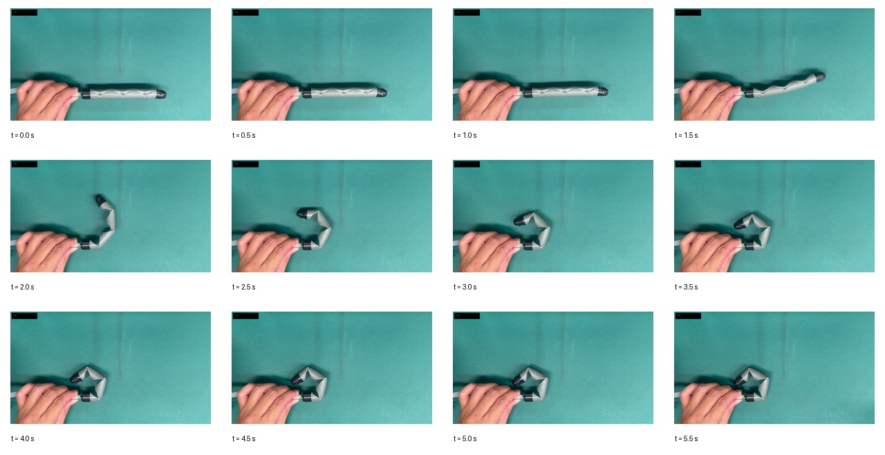

# Finger Bending Theta Analysis

This folder contains the final finger-bending angle analysis used to illustrate local joint deformation of a soft robotic finger.

## Contents

```text
video/
  finger_bending.mp4

raw_data/
  frame_preview.jpg
  frames_manifest.csv
  frames_0p5s/

point_data/
  theta_points.csv
  theta_angles.csv

excel/
  theta_analysis.xlsx
  theta_summary_preview.png

figures/
  theta_time_series.png
  theta_phase_plot.png
  labeled_frames/

angle_definition/
  theta_definition.png
```

## Angle Definition

The bending angles are defined locally around two finger joints:

```text
theta1 = 180 deg - angle(A1, J1, B1)
theta2 = 180 deg - angle(A2, J2, B2)
```

- `theta1`: distal joint bending angle, measured from the fingertip-side joint.
- `theta2`: proximal joint bending angle, measured from the next joint toward the finger base.
- `A1, J1, B1`: manually selected local points for `theta1`.
- `A2, J2, B2`: manually selected local points for `theta2`.

The first three samples from `0.0 s` to `1.0 s` are set to `0 deg` because the finger is visually straight in that segment.

## Preview

Frame preview used for manual point annotation:

<p align="center">
  
</p>

Angle definition:

<p align="center">
  
</p>

Theta time-series plot:

<p align="center">
  
</p>

Theta phase plot:

<p align="center">
  
</p>

## Data Files

- `point_data/theta_points.csv`: manually selected point coordinates for the two local joints.
- `point_data/theta_angles.csv`: final `theta1` and `theta2` angle values over time.
- `excel/theta_analysis.xlsx`: spreadsheet version of the angle analysis.
