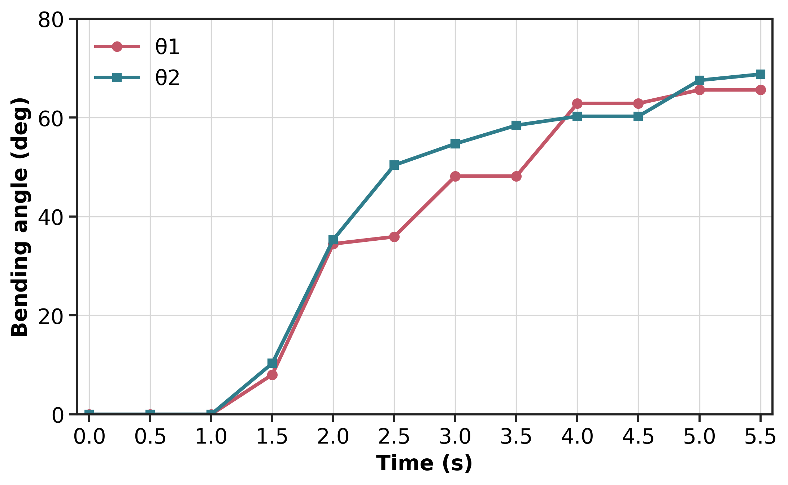
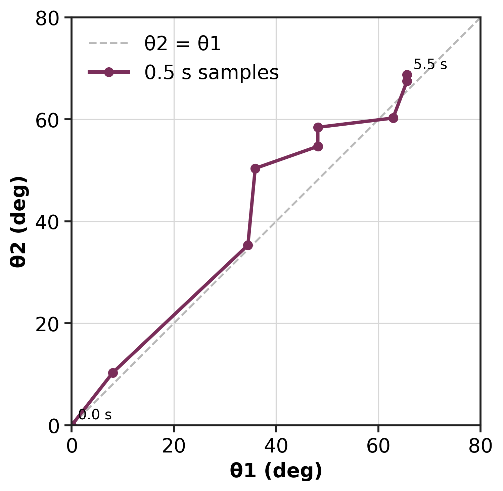

# Finger Bending θ Analysis

This folder contains the manually annotated finger-bending angle analysis used to illustrate local joint deformation of a soft robotic finger.

## Contents

```text
video/
  finger_curve.mp4

raw_data/
  frames_every_0p5s_raw/
  frames_every_0p5s_manifest.csv
  manual_theta_point_templates_contact_sheet.jpg

point_data/
  manual_theta_points_filled.csv
  manual_theta_points_corrected_angles.csv
  manual_theta_correction_report.csv
  theta_angles_corrected_greek.csv

excel/
  theta_angle_analysis.xlsx
  theta_angle_analysis_summary_preview.png

figures/
  theta1_theta2_time_series_greek.png
  theta1_theta2_phase_plot_greek.png
  manual_theta_labeled_frames/

angle_definition/
  theta_angle_definition_illustration.png
```

## Angle Definition

The bending angles are defined locally around two finger joints:

```text
θ1 = 180 deg - angle(A1, J1, B1)
θ2 = 180 deg - angle(A2, J2, B2)
```

- `θ1`: distal joint bending angle, measured from the fingertip-side joint.
- `θ2`: proximal joint bending angle, measured from the next joint toward the finger base.
- `A1, J1, B1`: manually selected local points for θ1.
- `A2, J2, B2`: manually selected local points for θ2.

The first three samples from `0.0 s` to `1.0 s` are set to `0 deg` because the finger is visually straight in that segment. A small late-stage θ1 fluctuation is corrected in `manual_theta_points_corrected_angles.csv`; the original clicked points remain in `manual_theta_points_filled.csv`.

## Key Figures

Frame preview used for manual point annotation:

<p align="center">
  
</p>

Angle definition:


θ1 / θ2 time-series plot:



θ1-θ2 relation:



## Workbook

The Excel workbook `excel/theta_angle_analysis.xlsx` includes:

- corrected θ1 / θ2 angle table,
- manually clicked point coordinates,
- formula-based local angle calculation,
- correction report,
- angle definition illustration.
